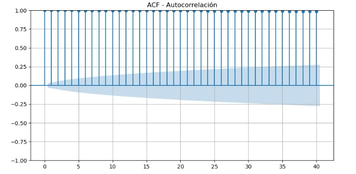
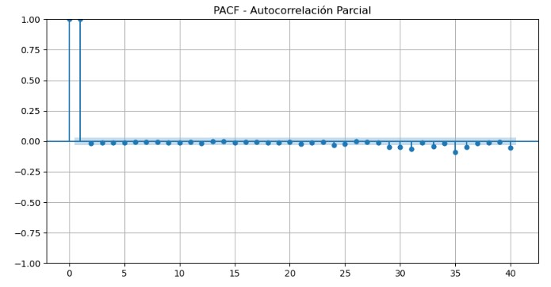

# Primer examen parcial
## Tasa de interés interbancaria de equilibrio (TIIE 28 días)

## 📝 Descripción del Proyecto
Este proyecto tiene como objetivo objetivo es realizar un modelo SARIMA que se capaz de *predecir el comportamiento de una serie de tiempo* a 28 días.
Se trabajará con un indicador financiero publicado por Banxico que refleja el costo del dinero en el mercado interbancario.

*Serie utilizada:*
- *Nombre:* Tasa de Interés Interbancaria de Equilibrio a 28 días (TIIE).  
- *Frecuencia*: Diaria
- *ID:* SF43783   
- *Pregunta guía:* “¿Qué tan bien SARIMA puede anticipar los movimientos diarios de la tasa de interés TIIE?”

---

## ¿Qué es TIIE?

La *Tasa de Interés Interbancaria de Equilibrio (TIIE)* es una tasa de referencia calculada y publicada diariamente por el Banco de México (*Banxico*) que refleja el costo promedio del crédito entre los bancos mexicanos. Sirve como base para fijar las tasas de interés de diversos productos financieros, como tarjetas de crédito y préstamos, influyendo así en los costos de financiamiento para empresas y consumidores.

### ¿Qué es y cómo funciona?

* *Tasa de referencia*: Es una tasa clave que el Banco de México utiliza para medir la liquidez del mercado bancario.
* *Cálculo diario*: Se calcula diariamente con base en las cotizaciones que los propios bancos presentan en el mercado de fondeo.
* *Relación con la política monetaria*: Está estrechamente ligada a la tasa de política monetaria del Banco de México, por lo que los cambios en esta última se reflejan directamente en la TIIE.

### ¿Para qué sirve la TIIE?

* *Referencia para productos financieros*: Se utiliza como referencia para establecer las tasas de interés de una gran variedad de productos financieros, como créditos y tarjetas de crédito.
* *Determinación de costos*: Los bancos la usan para fijar los costos de sus préstamos, y su comportamiento puede hacer que los créditos sean más caros o más baratos.
* *Impacto en la economía*: Cuando la TIIE baja, el costo del crédito tiende a disminuir, incentivando el consumo y la inversión. Por el contrario, un aumento en la TIIE puede encarecer los créditos.

### Tipos de TIIE

* *Por plazo*: Existen diferentes tipos de TIIE según el plazo para el que se calculen, como a 28, 91 o 182 días.
* *TIIE de Fondeo*: Es una versión más reciente, publicada diariamente, que también sirve como referencia para las operaciones pasivas (captación) de las instituciones financieras.

## 📂 Estructura del Proyecto

├── TIIE_28.ipynb          # Notebook con el desarrollo completo

├── README.md              # Documento de explicación y resultados

---

## 🔗 Conexión a la API de INEGI

Se utilizó la API de BANXICO para descargar la serie *SF43783*.  
El flujo de conexión incluye:

1. Conexión vía requests utilizando el token proporcionado por BANXICO.
2. Procesamiento de la respuesta JSON para convertirla en un DataFrame.
3. Limpieza y preparación de la serie para el modelo.

---

## 🔍 Análisis Exploratorio

1. Se realizarán dos distintos análisis, uno poniendo el ultimo valor del viernes en el sabado y domingo, y otro quitando los fines de semana.  
2. *Visualización inicial* de la serie para identificar tendencias y estacionalidad.
3. *Pruebas de estacionariedad:*
   - ADF (Augmented Dickey-Fuller)
   - KPSS (Kwiatkowski–Phillips–Schmidt–Shin)
4. *Gráficas ACF y PACF* para definir órdenes iniciales de:
   - (p, d, q) → Componente ARIMA
   - (P, D, Q, s) → Componente estacional

### ADF Y KPSS

**ADF**:

Estadístico ADF: -0.9859775017609876

p-value: 0.7583442657569961

**KPSS**:

Estadístico KPSS: 5.823344046403847

p-value: 0.01

### Gráfica ACF(Sin fines de semana)

### Gráfica PACF (sin fines de semana)

---

## 🤖 Modelo SARIMA

Se utilizó un modelo SARIMA porque:

- Se utilizó un modelo **SARIMA** porque permite capturar tanto la **dependencia temporal** (componentes autorregresivos y de medias móviles) como la **estacionalidad** presente en la serie. A diferencia de un modelo ARIMA tradicional, SARIMA incluye parámetros que modelan los patrones repetitivos observados en la frecuencia de días hábiles.  

- Tras realizar pruebas de estacionariedad (ADF y KPSS) y analizar las funciones de autocorrelación (ACF) y autocorrelación parcial (PACF), se seleccionaron los parámetros que mejor representan la dinámica de la serie. Este modelo fue entrenado sobre los datos históricos obtenidos de la API de Banxico y posteriormente utilizado para generar las predicciones de la semana del **22 al 26 de septiembre de 2025**.

*Ecuación general:*
\[
SARIMA(p,d,q)(P,D,Q,s)
\]

*Parámetros seleccionados:*

| Parámetro | Valor | Justificación |
|-----------|-------|---------------|
| p         | 1     | Basado en PACF (rezago significativo) |
| d         | 1     | Serie no estacionaria según ADF/KPSS, se aplicó una diferenciación |
| q         | 1     | Basado en ACF (rezago significativo) |
| P         | 0     | No se detectaron rezagos AR estacionales |
| D         | 0     | No se requirió diferenciación estacional según KPSS |
| Q         | 1     | Basado en ACF estacional |
| s         | 5     | Estacionalidad semanal de 5 días hábiles |

---

## 📊 Resultados de la Predicción

Gráfica generada con *Plotly* mostrando:
- Datos históricos.
- Predicciones del modelo para la semana del 22-26 Sep 2025.

> Aquí se incluye el gráfico interactivo.

---

## 🧮 Evaluación del Modelo

Se calculó el *MAPE (Mean Absolute Percentage Error)* utilizando los últimos 12 valores como datos de validación:

\[
MAPE = \frac{100\%}{n} \sum_{t=1}^{n} \left| \frac{y_t - \hat{y}_t}{y_t} \right|
\]

| Métrica  | Valor |
|-----------|-------|
| MAPE (%)  | 7.98% |

---

## 📌 Conclusiones
- Resumen de la calidad del modelo.
- Posibles causas de error, como:
  - Volatilidad en el mercado.
  - Shocks externos (políticos, económicos, etc.).
  - Limitaciones del modelo SARIMA.
